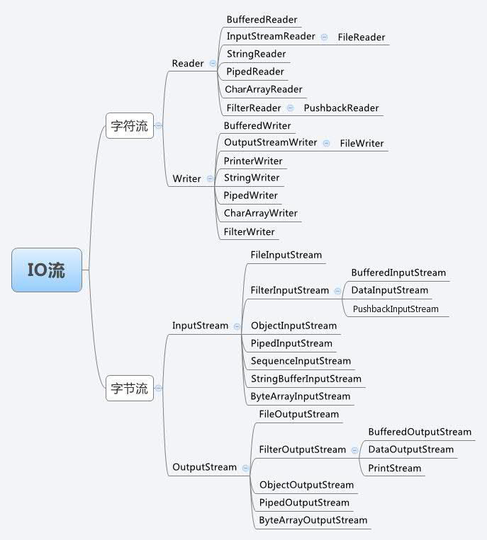

## Java 流(Stream)、文件(File)和IO

Java 中的流（Stream）、文件（File）和 IO（输入输出）是处理数据读取和写入的基础设施，它们允许程序与外部数据（如文件、网络、系统输入等）进行交互。

java.io 包是 Java 标准库中的一个核心包，提供了用于系统输入和输出的类，它包含了处理数据流（字节流和字符流）、文件读写、序列化以及数据格式化的工具。

一个流可以理解为一个数据的序列。输入流表示从一个源读取数据，输出流表示向一个目标写数据。



## ArrayList

ArrayList 是一个数组队列，相当于动态数组。继承于 AbstractList，实现了 List, RandomAccess, Cloneable, java.io.Serializable 这些接口。


## LinkedList

LinkedList 继承了 AbstractSequentialList 类。

LinkedList 实现了 Queue 接口，可作为队列使用。

LinkedList 实现了 List 接口，可进行列表的相关操作。

LinkedList 实现了 Deque 接口，可作为队列使用。

LinkedList 实现了 Cloneable 接口，可实现克隆。

LinkedList 实现了 java.io.Serializable 接口，即可支持序列化，能通过序列化去传输。


## HashSet

HashSet 基于 HashMap 来实现的，是一个不允许有重复元素的集合。

HashSet 允许有 null 值。

HashSet 是无序的，即不会记录插入的顺序。

HashSet 不是线程安全的， 如果多个线程尝试同时修改 HashSet，则最终结果是不确定的。 您必须在多线程访问时显式同步对 HashSet 的并发访问。

HashSet 实现了 Set 接口。


## HashMap

HashMap 是一个散列表，它存储的内容是键值对(key-value)映射。

HashMap 实现了 Map 接口，根据键的 HashCode 值存储数据，具有很快的访问速度，最多允许一条记录的键为 null，不支持线程同步。

HashMap 是无序的，即不会记录插入的顺序。

HashMap 继承于AbstractMap，实现了 Map、Cloneable、java.io.Serializable 接口。


```java
// 使用 Map.of() 创建一个不可变的 Map
Map<Integer, String> map = Map.of(1, "Google", 2, "Facebook", 3, "Amazon", 4, "Microsoft");

// 迭代 HashMap
HashMap<Integer, String> Sites = new HashMap<Integer, String>();
// 输出 key 和 value
        for (Integer i : Sites.keySet()) {
            System.out.println("key: " + i + " value: " + Sites.get(i));
        }
        // 返回所有 value 值
        for(String value: Sites.values()) {
          // 输出每一个value
          System.out.print(value + ", ");
        }
```

## Iterator（迭代器）

Java迭代器（Iterator）是 Java 集合框架中的一种机制，是一种用于遍历集合（如列表、集合和映射等）的接口。

它提供了一种统一的方式来访问集合中的元素，而不需要了解底层集合的具体实现细节。

Java Iterator（迭代器）不是一个集合，它是一种用于访问集合的方法，可用于迭代 ArrayList 和 HashSet 等集合。

Iterator 是 Java 迭代器最简单的实现，ListIterator 是 Collection API 中的接口， 它扩展了 Iterator 接口。


注意：Java 迭代器是一种单向遍历机制，即只能从前往后遍历集合中的元素，不能往回遍历。同时，在使用迭代器遍历集合时，不能直接修改集合中的元素，而是需要使用迭代器的 remove() 方法来删除当前元素。

## Object

Java Object 类是所有类的父类，也就是说 Java 的所有类都继承了 Object，子类可以使用 Object 的所有方法。

Object 类位于 java.lang 包中，编译时会自动导入，我们创建一个类时，如果没有明确继承一个父类，那么它就会自动继承 Object，成为 Object 的子类。

## 泛型

```markdown
java 中泛型标记符：

E - Element (在集合中使用，因为集合中存放的是元素)
T - Type（Java 类）
K - Key（键）
V - Value（值）
N - Number（数值类型）
？ - 表示不确定的 java 类型
```

## Java 序列化Serializable

Java 序列化是一种将对象转换为字节流的过程，以便可以将对象保存到磁盘上，将其传输到网络上，或者将其存储在内存中，以后再进行反序列化，将字节流重新转换为对象。

序列化在 Java 中是通过 java.io.Serializable 接口来实现的，该接口没有任何方法，只是一个标记接口，用于标识类可以被序列化。

## 网络编程

## 发送邮件

## 多线程编程


## HashMap的实现原理

HashMap 是一种基于哈希表的数据结构，用于存储键值对。它的底层实现主要依赖于数组和链表，在 JDK 1.8 之后还引入了红黑树来优化性能。

HashMap 是 Java 中常用的数据结构之一，它基于哈希表实现，可以提供快速的查找、插入和删除操作。HashMap 的实现原理主要包括以下几个方面：

1. 哈希函数：HashMap 使用哈希函数将键值对映射到哈希表中。哈希函数将键转换为哈希码，然后根据哈希码将键值对存储在哈希表中。哈希函数的选择对 HashMap 的性能有很大影响，一个好的哈希函数应该能够将键均匀地分布到哈希表中，以减少冲突。
2. 冲突解决：当两个不同的键映射到同一个哈希码时，就会发生冲突。HashMap 使用链表来解决冲突，将具有相同哈希码的键值对存储在同一个链表中。当链表长度超过一定阈值时，HashMap 会将链表转换为红黑树，以提高查找效率。
3. 扩容：当 HashMap 中的元素数量超过一定阈值时，HashMap 会进行扩容，即创建一个新的哈希表，并将原来的元素重新映射到新的哈希表中。扩容操作可以保证 HashMap 的性能不会因为元素数量的增加而下降。
4. 线程安全：HashMap 不是线程安全的，如果多个线程同时访问和修改 HashMap，可能会导致数据不一致的问题。如果需要在多线程环境下使用 HashMap，可以使用 Collections.synchronizedMap() 方法将其包装为一个线程安全的 Map，或者使用 ConcurrentHashMap。

## HashMap和HashTable的区别

HashMap和HashTable都是Java中常用的数据结构，它们都是基于哈希表实现的，但它们之间有一些重要的区别：

1. 线程安全：HashMap不是线程安全的，如果多个线程同时访问和修改HashMap，可能会导致数据不一致的问题。而HashTable是线程安全的，它使用synchronized关键字来保证线程安全。因此，在多线程环境下，如果需要使用HashMap，可以使用Collections.synchronizedMap()方法将其包装为一个线程安全的Map。

2. 空键和空值：HashMap允许使用null作为键和值，而HashTable不允许使用null作为键，但允许使用null作为值。因此，如果需要存储null键或null值，应该使用HashMap。

3. 性能：由于HashMap不是线程安全的，因此在单线程环境下，HashMap的性能通常优于HashTable。而在多线程环境下，由于HashTable使用了synchronized关键字来保证线程安全，因此它的性能可能会比HashMap差一些。

4. 迭代器：HashMap和HashTable都实现了Iterator接口，但它们的迭代器在遍历过程中删除元素的方式不同。在HashMap中，如果在迭代过程中删除元素，会抛出ConcurrentModificationException异常。而在HashTable中，如果在迭代过程中删除元素，会抛出UnsupportedOperationException异常。

`ArrayList 线程安全吗？为什么？`

ArrayList 不是线程安全的，因为它没有使用任何同步机制来保证线程安全。在多线程环境下，如果多个线程同时访问和修改 ArrayList，可能会导致数据不一致的问题。例如，一个线程正在遍历 ArrayList，而另一个线程正在修改 ArrayList，这可能会导致遍历过程中出现异常或者遍历结果不准确。因此，如果需要在多线程环境下使用 ArrayList，可以使用 Collections.synchronizedList() 方法将其包装为一个线程安全的 List，或者使用 CopyOnWriteArrayList 类。

## 创建线程的方法

在Java中，有几种常见的方法可以创建线程：

1. 继承Thread类：创建一个类，继承自Thread类，并重写run()方法。然后创建该类的实例，并调用start()方法来启动线程。

```java
public class MyThread extends Thread {
    @Override
    public void run() {
        // 线程执行的代码
    }
}

MyThread thread = new MyThread();
thread.start();
```


2. 实现Runnable接口：创建一个类，实现Runnable接口，并重写run()方法。然后创建一个Thread对象，并将实现了Runnable接口的类的实例作为参数传递给Thread对象的构造函数。最后，调用Thread对象的start()方法来启动线程。

```java
public class MyRunnable implements Runnable {
    @Override
    public void run() {
        // 线程执行的代码
    }
}

MyRunnable runnable = new MyRunnable();
Thread thread = new Thread(runnable);
thread.start();
```


3. 使用Callable和Future：创建一个类，实现Callable接口，并重写call()方法。然后创建一个FutureTask对象，并将实现了Callable接口的类的实例作为参数传递给FutureTask对象的构造函数。最后，创建一个Thread对象，并将FutureTask对象作为参数传递给Thread对象的构造函数。最后，调用Thread对象的start()方法来启动线程。

```java
public class MyCallable implements Callable<Integer> {
    @Override 
    public Integer call() throws Exception {
        // 线程执行的代码
        return 0;
    }
}

MyCallable callable = new MyCallable();
FutureTask<Integer> task = new FutureTask<>(callable);
Thread thread = new Thread(task);
thread.start();
```


4. 使用线程池：使用线程池可以有效地管理和复用线程，提高程序的性能和响应速度。Java提供了Executors工厂类来创建不同类型的线程池，如FixedThreadPool、CachedThreadPool、ScheduledThreadPool等。

```java
ExecutorService executor = Executors.newFixedThreadPool(10);
executor.execute(new Runnable() {
    @Override
    public void run() {
        // 线程执行的代码
    }


}
executor.shutdown();
```

5. 使用线程池和Callable：与使用Runnable类似，可以使用Callable和Future来创建线程，并使用线程池来管理和复用线程。

```java
ExecutorService executor = Executors.newFixedThreadPool(10);
Callable<Integer> callable = new Callable<Integer>() {
    @Override
    public Integer call() throws Exception {
        // 线程执行的代码
        return 0;
    }
};

Future<Integer> future = executor.submit(callable);
executor.shutdown();
```

6. 使用CompletableFuture：CompletableFuture是Java 8引入的一个类，它提供了一种更简洁和灵活的方式来处理`异步编程`。可以使用CompletableFuture来创建线程，并使用其提供的方法来处理线程的执行结果。

```java
CompletableFuture<Integer> future = CompletableFuture.supplyAsync(() -> {
    // 线程执行的代码
    return 0;
});
```

Java 提供了三种创建线程的方法：

通过实现 Runnable 接口；
通过继承 Thread 类本身；
通过 Callable 和 Future 创建线程。

总结：Java提供了多种方式来创建线程，包括使用Runnable、Callable、线程池和CompletableFuture等。选择哪种方式取决于具体的需求和场景。

## Java 中多线程用到的场景

1. 并行处理：多线程可以用于并行处理任务，提高程序的执行效率。例如，在处理大量数据时，可以使用多线程来同时处理多个数据块，从而加快处理速度。

2. 异步处理：多线程可以用于异步处理任务，提高程序的响应速度。例如，在处理网络请求时，可以使用多线程来同时处理多个请求，从而提高程序的响应速度。

3. 资源共享：多线程可以用于资源共享，提高程序的并发性能。例如，在多个线程之间共享同一个数据库连接，可以提高数据库的并发访问性能。

4. 线程池：多线程可以用于线程池，提高线程的复用性。例如，在Web服务器中，可以使用线程池来管理线程，从而提高服务器的并发性能。

5. 定时任务：多线程可以用于定时任务，提高程序的定时执行能力。例如，在定时发送邮件、定时备份文件等场景中，可以使用多线程来实现定时任务。

6. 并发控制：多线程可以用于并发控制，提高程序的并发安全性。例如，在多个线程同时访问共享资源时，可以使用多线程来控制并发访问，从而避免数据竞争和死锁等问题。

总结：Java中多线程用到的场景包括并行处理、异步处理、资源共享、线程池、定时任务和并发控制等。选择哪种场景取决于具体的需求和场景。

## 线程池的参数

线程池的参数主要包括以下几个：

1. corePoolSize：核心线程数，即线程池中始终保持活跃的线程数。当线程池中的线程数少于核心线程数时，会创建新的线程来处理任务。当线程池中的线程数等于核心线程数时，任务会进入队列等待。

2. maximumPoolSize：最大线程数，即线程池中允许的最大线程数。当线程池中的线程数超过最大线程数时，新任务会被拒绝。

3. keepAliveTime：线程空闲时间，即线程在空闲状态下的最大存活时间。当线程池中的线程数超过核心线程数时，多余的线程会在空闲时间到达后自动销毁。

4. workQueue：任务队列，即线程池中用于存放等待执行的任务的队列。当线程池中的线程数等于核心线程数时，新任务会被放入队列等待。当队列已满时，新任务会被拒绝。

5. threadFactory：线程工厂，用于创建新线程的工厂。可以通过`自定义线程工厂`来设置`线程的名称、优先级、守护状态等`属性。

