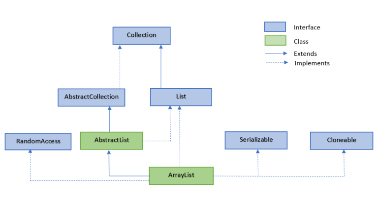
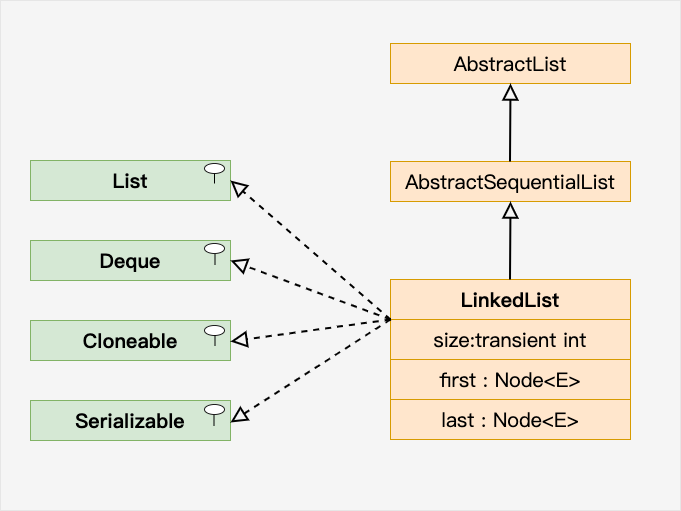
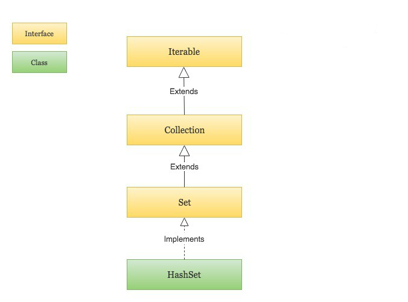
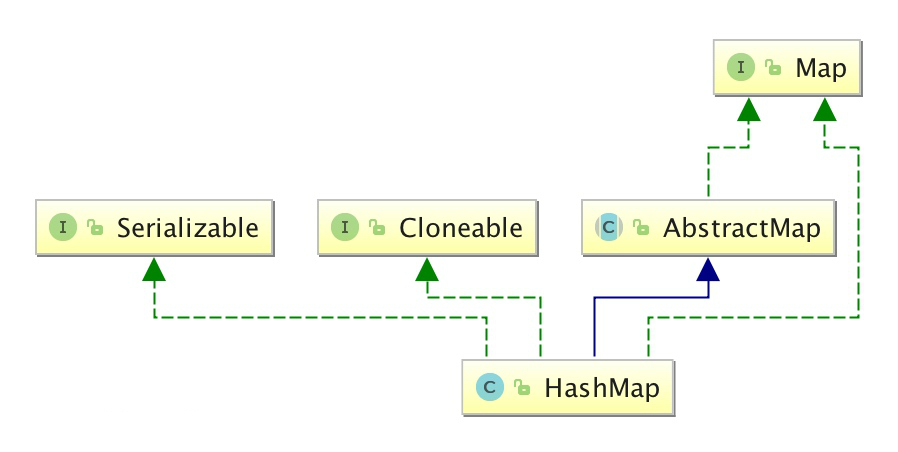
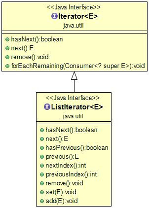

## ArrayList

ArrayList 是一个数组队列，相当于动态数组。继承于 AbstractList，实现了 List, RandomAccess, Cloneable, java.io.Serializable 这些接口。




## LinkedList

LinkedList 继承了 AbstractSequentialList 类。

LinkedList 实现了 Queue 接口，可作为队列使用。

LinkedList 实现了 List 接口，可进行列表的相关操作。

LinkedList 实现了 Deque 接口，可作为队列使用。

LinkedList 实现了 Cloneable 接口，可实现克隆。

LinkedList 实现了 java.io.Serializable 接口，即可支持序列化，能通过序列化去传输。



## HashSet

HashSet 基于 HashMap 来实现的，是一个不允许有重复元素的集合。

HashSet 允许有 null 值。

HashSet 是无序的，即不会记录插入的顺序。

HashSet 不是线程安全的， 如果多个线程尝试同时修改 HashSet，则最终结果是不确定的。 您必须在多线程访问时显式同步对 HashSet 的并发访问。

HashSet 实现了 Set 接口。



## HashMap

HashMap 是一个散列表，它存储的内容是键值对(key-value)映射。

HashMap 实现了 Map 接口，根据键的 HashCode 值存储数据，具有很快的访问速度，最多允许一条记录的键为 null，不支持线程同步。

HashMap 是无序的，即不会记录插入的顺序。

HashMap 继承于AbstractMap，实现了 Map、Cloneable、java.io.Serializable 接口。



```java
// 使用 Map.of() 创建一个不可变的 Map
Map<Integer, String> map = Map.of(1, "Google", 2, "Facebook", 3, "Amazon", 4, "Microsoft");

// 迭代 HashMap
HashMap<Integer, String> Sites = new HashMap<Integer, String>();
// 输出 key 和 value
        for (Integer i : Sites.keySet()) {
            System.out.println("key: " + i + " value: " + Sites.get(i));
        }
        // 返回所有 value 值
        for(String value: Sites.values()) {
          // 输出每一个value
          System.out.print(value + ", ");
        }
```


## Iterator（迭代器）

Java迭代器（Iterator）是 Java 集合框架中的一种机制，是一种用于遍历集合（如列表、集合和映射等）的接口。

它提供了一种统一的方式来访问集合中的元素，而不需要了解底层集合的具体实现细节。

Java Iterator（迭代器）不是一个集合，它是一种用于访问集合的方法，可用于迭代 ArrayList 和 HashSet 等集合。

Iterator 是 Java 迭代器最简单的实现，ListIterator 是 Collection API 中的接口， 它扩展了 Iterator 接口。



注意：Java 迭代器是一种单向遍历机制，即只能从前往后遍历集合中的元素，不能往回遍历。同时，在使用迭代器遍历集合时，不能直接修改集合中的元素，而是需要使用迭代器的 remove() 方法来删除当前元素。

## Object

Java Object 类是所有类的父类，也就是说 Java 的所有类都继承了 Object，子类可以使用 Object 的所有方法。

Object 类位于 java.lang 包中，编译时会自动导入，我们创建一个类时，如果没有明确继承一个父类，那么它就会自动继承 Object，成为 Object 的子类。

## 泛型

```markdown
java 中泛型标记符：

E - Element (在集合中使用，因为集合中存放的是元素)
T - Type（Java 类）
K - Key（键）
V - Value（值）
N - Number（数值类型）
？ - 表示不确定的 java 类型
```

## Java 序列化Serializable

Java 序列化是一种将对象转换为字节流的过程，以便可以将对象保存到磁盘上，将其传输到网络上，或者将其存储在内存中，以后再进行反序列化，将字节流重新转换为对象。

序列化在 Java 中是通过 java.io.Serializable 接口来实现的，该接口没有任何方法，只是一个标记接口，用于标识类可以被序列化。

## 网络编程

## 发送邮件

## 多线程编程

